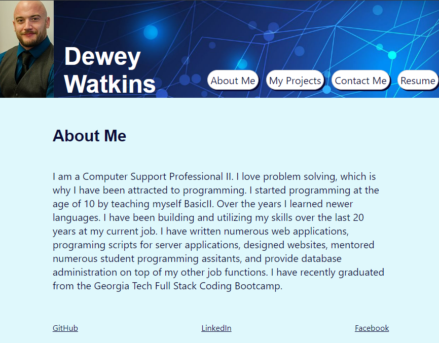

# portfolio


## Description

Portfolio website that displays my projects and information using modern programming technologies.

## Table of Contents 

* [Installation](#installation)

* [Usage](#usage)

* [License](#license)

* [Contributing](#contributing)

* [Tests](#tests)

* [Questions](#questions)

## Installation

To install necessary dependencies, run the following command:

```
npm i
```

## Usage
Click the nav links in the upper right corner to view their corresponding pages

[Depolyed Site](https://deweywatkins77.github.io/portfolio)




## License

This project is licensed under the MIT license.
  
## Contributing

For contributions please contact me at deweywatkins77@gmail.com

## Tests

To run tests, run the following command:

```
N/A
```

## Questions

If you have any questions about the repo, open an issue or contact me directly at deweywatkins77@gmail.com. You can find more of my work at [deweywatkins77](https://github.com/deweywatkins77/).
